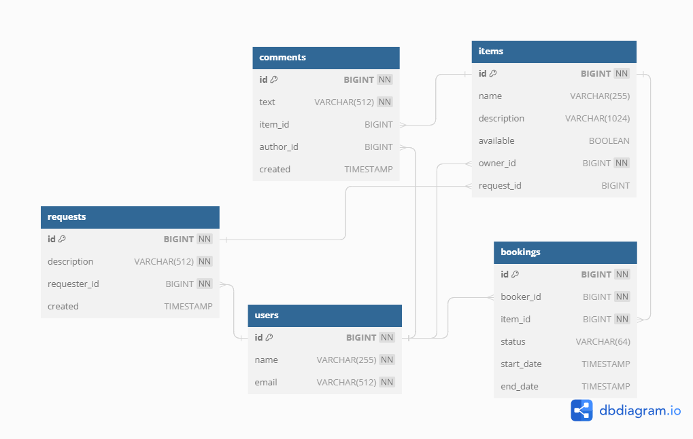

# java-shareit
### Приложение для обмена вещами.

Сервис позволяет пользователям искать вещи по текстовому запросу, просматривать список вещей, доступных для аренды, 
бронировать выбранную вещь на определенные даты.
Также реализована возможность создавать запрос на вещь, если пользователь не нашел то, что искал.
Другие пользователи могут просматривать запросы и добавлять новые вещи.
Кроме того, реализована возможность оставления комментариев к вещам, но только если пользователь уже арендовал вещь.

Технологический стек:
- Java 11
- Spring Boot
- Maven
- Lombok
- PostgreSQL
- H2
- Docker
- Hibernate
- Mockito
- JUnit

**Функционал:** 
Для всех сущностей (пользователи, вещи, запросы на аренду, запросы на добавление вещей, комментарии) доступны:
- добавление
- обновление
- просмотр
- удаление

### ER-диаграмма

<a href="https://dbdiagram.io/d/651a3290ffbf5169f0d600aa">Ссылка на диаграмму в редакторе</a>

### Описание базы данных

#### users
Данные о пользователях.

**Поля:**
* id — идентификатор записи, первичный ключ
* name — уникальное имя пользователя
* email — уникальный адрес электронной почты

#### items
Данные о вещах.

**Поля:**
* id — идентификатор записи, первичный ключ
* name — название вещи
* description — описание
* available — доступность для бронирования
* owner_id — id владельца
* request_id — id запроса(если предмет был создан по запросу)

#### comments
Данные о комментариях к вещам.

**Поля:**
* id — идентификатор записи, первичный ключ
* text — текст комментария
* item_id — id вещи
* author_id — id автора комментария
* created — дата написания комментария

#### bookings
Данные о бронированиях вещей.

**Поля:**
* id — идентификатор записи, первичный ключ
* booker_id — id бронирующего пользователя
* item_id — id вещи для бронирования
* status — статус бронирования (WAITING, APPROVED, REJECTED или CANCELED)
* start_date — дата начала бронирования
* end_date — дата окончания бронирования

#### requests
Данные о запросах на создание вещей.

**Поля:**
* id — идентификатор записи, первичный ключ
* description — описание
* requester_id — id пользователя, создавшего запрос
* created — дата создания запроса